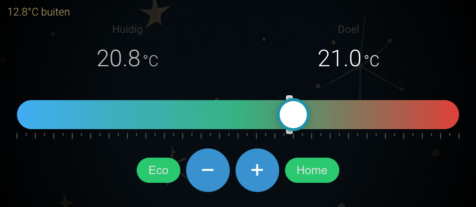

# InnoDIGI Thermostat Card for Home Assistant

A modern, touch-friendly thermostat card for Home Assistant with an intuitive horizontal slider interface.



## ☕ Donate

Do you find this custom card useful? Consider a donation to support development!

[Donate with PayPal](https://www.paypal.com/ncp/payment/KYWBUB3324S9G)

Every contribution is appreciated and helps keep the card improving and maintained. Thank you! 🙏

## Features

- 🌡️ **Dual temperature display**: Shows both current and target temperature
- 📊 **Horizontal slider**: Touch-friendly bar instead of circular interface
- 🎯 **Visual feedback**: Large temperature display while dragging
- 🏠 **Preset modes**: Quick switching between Eco and Home modes
- ➕➖ **Plus/Minus buttons**: Precise temperature control
- 🎨 **Modern UI**: Smooth animations and gradient slider
- 🔄 **Real-time updates**: Immediate feedback on interaction
- ✅ **Compatible**: Works with all generic thermostat entities
- 🎛️ **Visual editor**: Easy configuration via UI without YAML

## Installation

### HACS (Recommended)

#### Option 1: Via HACS Custom Repository

1. Open HACS in your Home Assistant
2. Click on "Frontend" 
3. Click the 3 dots menu (⋮) in the top right
4. Select "Custom repositories"
5. Add the repository:
   - **Repository**: `https://github.com/Alseenrodelap/homeassistant-innodigi-thermostat`
   - **Category**: `Lovelace`
6. Click "Add"
7. Search for "InnoDIGI Thermostat Card" in HACS
8. Click "Download" 
9. Restart Home Assistant

#### Option 2: Default HACS Store (Coming soon)

Once approved for the default HACS store:
1. Open HACS in your Home Assistant
2. Go to "Frontend"
3. Click the "+" button
4. Search for "InnoDIGI Thermostat Card"
5. Click "Download"
6. Restart Home Assistant

### Manual Installation

1. Download `innodigi-thermostat-card.js`
2. Copy the file to `/config/www/` in your Home Assistant installation
3. Add the following line to your `configuration.yaml`:

```yaml
lovelace:
  resources:
    - url: /local/innodigi-thermostat-card.js
      type: module
```

4. Restart Home Assistant

## Configuration

### Via Visual Editor (Recommended) ⭐

1. Go to your dashboard
2. Click the menu button (⋮) in the top right and select "Edit Dashboard"
3. Click "+ ADD CARD"
4. Scroll down and select **"Custom: Innodigi Thermostat Card"**
5. Configure the card:
   - **Basic Settings**:
     - Select your thermostat entity via the dropdown
     - Optionally add a custom name
   - **Temperature Settings**:
     - Set the Eco target temperature (default 18°C)
     - Set the Home target temperature (default 21°C)
   - **Color Settings**:
     - Choose the color for cold temperatures (left)
     - Choose the color for medium temperatures (middle)
     - Choose the color for warm temperatures (right)
6. Click "SAVE"

The card has a visual editor with live preview, so you don't need to write YAML! 🎉

### Via YAML (Alternative)

You can also configure the card manually:

#### Basic configuration

```yaml
type: custom:innodigi-thermostat-card
entity: climate.living_room
```

#### Full configuration

```yaml
type: custom:innodigi-thermostat-card
entity: climate.living_room
name: Living Room Thermostat
color_cold: '#3498db'
color_medium: '#2ecc71'
color_hot: '#e74c3c'
eco_temperature: 18
home_temperature: 21
```

## Configuration Options

| Option | Type | Required | Default | Description |
|--------|------|----------|---------|-------------|
| `type` | string | Yes | - | `custom:innodigi-thermostat-card` |
| `entity` | string | Yes | - | The climate entity ID |
| `name` | string | No | Entity name | Name of the thermostat |
| `color_cold` | string | No | `#3498db` | Color for left side of bar (cold) |
| `color_medium` | string | No | `#2ecc71` | Color for middle of bar |
| `color_hot` | string | No | `#e74c3c` | Color for right side of bar (warm) |
| `eco_temperature` | number | No | `18` | Target temperature for Eco mode |
| `home_temperature` | number | No | `21` | Target temperature for Home mode |

## Usage

### Setting Temperature

There are three ways to set the target temperature:

1. **Dragging on the bar**: Click or touch the colored bar and drag. The white circle follows your finger and shows the temperature.
2. **Plus/Minus buttons**: Use the + and - buttons for precise adjustments.
3. **Direct clicking**: Click or touch a point on the bar to directly set that temperature.

### Preset Modes

- **Eco**: Sets the thermostat to your configured Eco temperature (default 18°C)
- **Home**: Sets the thermostat to your configured Home temperature (default 21°C)

Click the buttons at the top of the card to quickly switch to these preset temperatures. You can adjust these temperatures in the visual editor!

### Visual Indicators

- **White line**: Shows the current temperature
- **White circle**: Shows the target temperature
- **Color gradient**: From blue (cold) through green to red (warm)

## Compatibility

This card works with all climate entities that support the following attributes:

- `current_temperature` - Current temperature
- `temperature` - Target temperature
- `min_temp` - Minimum temperature
- `max_temp` - Maximum temperature
- `target_temp_step` - Temperature step (optional, default 0.5)
- `preset_mode` - Current preset mode (optional)

Compatible thermostats:
- Generic Thermostat
- Netatmo
- Nest
- Tado
- Honeywell
- And many others

## License

MIT License - See LICENSE file for details

## Credits

Developed by Elco for use with Innodigi thermostats and compatible systems.

## Support

For questions, bugs, or feature requests, please open an issue on GitHub:
https://github.com/elco/homeassistant-innodigi-thermostat/issues

## ☕ Donate

Do you find this custom card useful? Consider a donation to support development!

[Donate with PayPal](https://www.paypal.com/ncp/payment/KYWBUB3324S9G)

Every contribution is appreciated and helps keep the card improving and maintained. Thank you! 🙏
